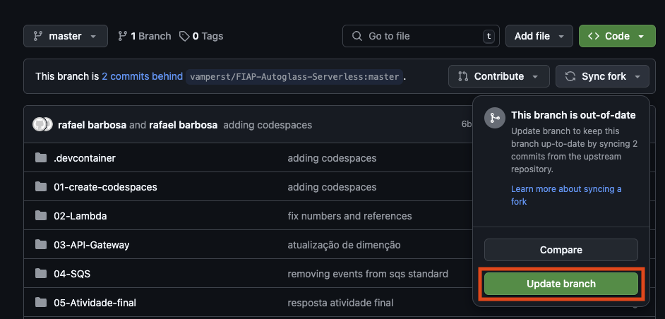
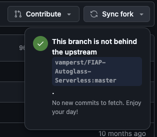
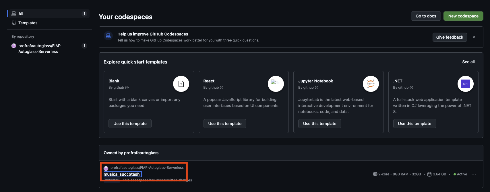
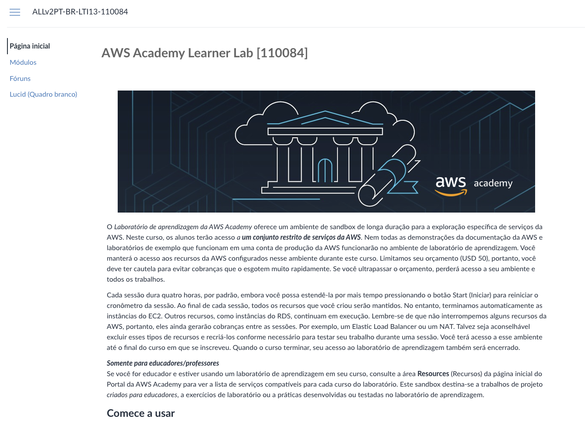
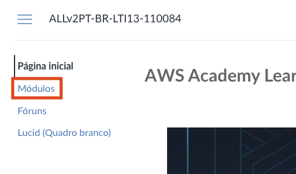
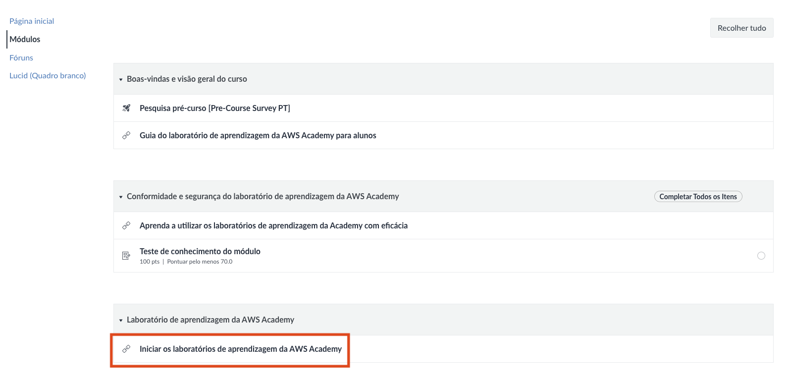

# 01.1 - Inicio de toda aula

Toda aula começamos com o mesmo passo a passo.
Você pode pular essa parte caso já tenha feito isso antes na aula de **HOJE**.

Durante o setup você criou uma conta AWS Academy e um Codespaces. Caso não tenha feito isso, siga os passos do [tutorial de setup](./README.md).

Execute os passos abaixo no inicio de cada aula:

1. Acesse o seu github no repositório que fez fork do repositório da disciplina **FIAP-Autoglass-Serverless**.
2. Clique em `Sync Fork` no meio da tela para sincronizar o repositório com o repositório original. Caso tenha algo para sincronizar, clique em `Update branch` para sincronizar o repositório como na imagem abaixo:
   
   
   

   


> **Atenção:** Caso não tenha nada para sincronizar, a mensagem será `This branch is not behind the upstream` e não será necessário fazer nada.

   


3. Acesse o seu codespaces, para isso acesse o link [Github Codespaces](https://github.com/codespaces)
4. Clique no nome do Codespaces que você criou para as aulas, ele esta derivado do repositório FIAP-Autoglass-Serverless. 

    

5. No terminal do Codespaces, execute o comando abaixo para atualizar o repositório local com as alterações do repositório remoto:
   
   ```bash
   git pull origin master
   ```
6. Após isso, vamos atualizar as credenciais do AWS CLI. Execute o comando abaixo para atualizar as credenciais:
   
   ```bash
   code ~/.aws/credentials
   ```
7. Após isso, clique no arquivo `credentials` que abrirá e cole as credenciais que estão na sua conta do AWS Academy. Para isso, acesse o o [AWS Academy](https://www.awsacademy.com/vforcesite/LMS_Login) e clique em `AWS Academy Learner Lab` para acessar a conta AWS Academy no laboratório que o professor informou.

    

8. Na lateral esquerda, clique em `AWS Academy Learner Lab` e clique em `Módulos`

    

9. Clique em `Iniciar os laboratórios de aprendizagem da AWS Academy`
    
    

10. Clique em `Start Lab` para iniciar o laboratório. Aguarde até que a bolinha ao lado do escrito `AWS` no superior esquerdo da tela fique verde como na imagem abaixo. Apenas clique em `AWS` para abrir a conta aws em outra aba do navegador.

    

11. Após isso, ainda na aba do aws academy, clique em `AWS Details` do lado superior direito da tela. 
    
12. Em `AWS CLI` clique em `Show` para ver as credenciais de acesso a conta AWS Academy.
    
13. Copie as credenciais e cole no arquivo `credentials` que você abriu no passo 6 no codespaces. Após isso, salve o arquivo e feche.