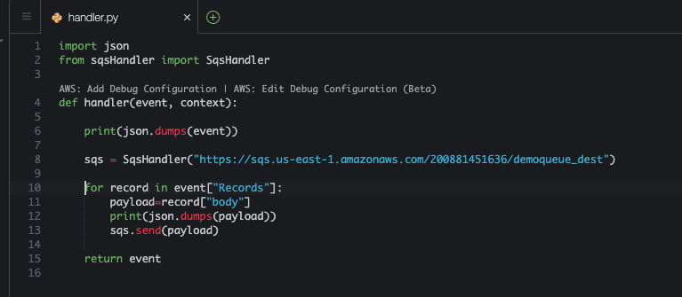
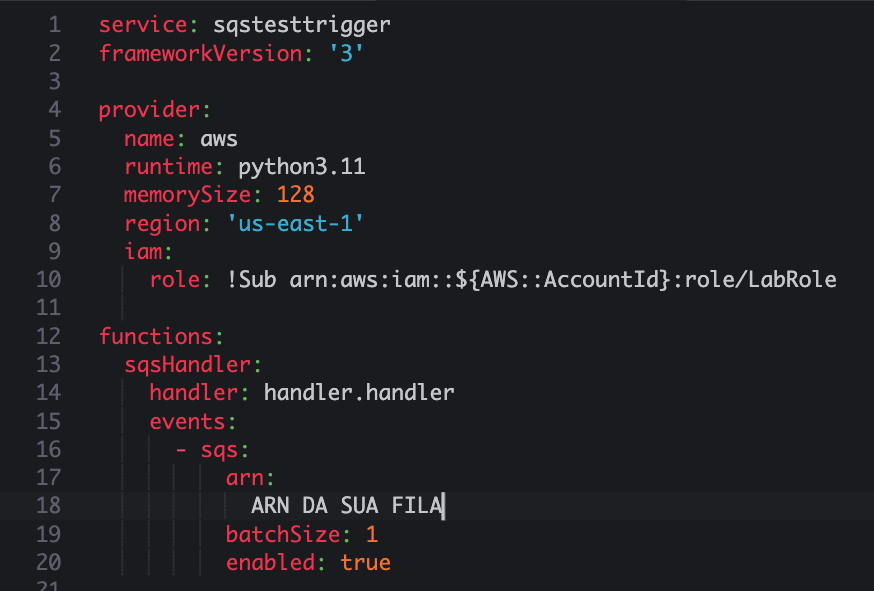

# Aula 04.3 - Lambda

**Antes de começar, execute os passos abaixo para configurar o ambiente caso não tenha feito isso ainda na aula de HOJE: [Preparando Credenciais](../../01-create-codespaces/Inicio-de-aula.md)**

1. No terminal do IDE criado no codespaces execute o comando `cd /workspaces/FIAP-Autoglass-Serverless/04-SQS/03-Lambda/` para entrar na pasta que fara este exercicio.
2. Execute o comando `sls create --template "aws-python3"` no terminal para criar os arquivos do serverless framework.
3. Altere o handler.py para ficar como na imagem. Não esqueça de colocar a URL da sua fila de destino. Abra com o comando `code handler.py`. Para conseguir a URL da fila de destino você pode utilizar o comando `aws sqs get-queue-url --queue-name demoqueue_dest | jq .QueueUrl`

   
   
5. Altere o serverless.yml para que fique como na imagem. Para abrir utilize `code serverless.yml `. Para pegar o ARN da fila demoqueue utilize o comando abaixo:
``` shell
demoqueueURL=`aws sqs get-queue-url --queue-name demoqueue | jq -r .QueueUrl` && aws sqs get-queue-attributes --queue-url $demoqueueURL --attribute-names QueueArn | jq -r .Attributes.QueueArn
```
   
   
   
5. Vá a sua aba do SQS e configure sua demoqueue para ficar como na imagem, isso é necessário pois o tempo de visibilidade padrão estava em 1 segundo para forçar erros no teste da DLQ do ultimo exercicio:

   
   
7. Execute o comando `sls deploy` no terminal.
8. Altere o arquivo put.py colocando a URL da sua fila demoqueue. Abra com `code put.py`.
9. Execute o comando `python3 put.py` no terminal e observe no [painel do sqs](https://us-east-1.console.aws.amazon.com/sqs/v3/home?region=us-east-1#/queues) que as mensagens estão indo para a fila de destino.
    
   
   
11.  Para excluir a stack do lambda execute o comando `sls remove` no terminal.
